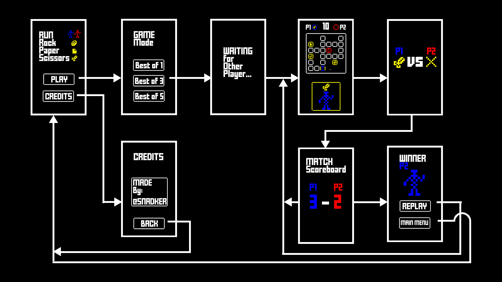

# RUN RockPaperScissors

## Concepto

### Diseñador

Álvaro Gómez Haro - @snadker 

### Plataforma

Web y posiblemente web para dispositivos móviles

### Sinopsis de jugabilidad

RUN RockPaperScissors es un juego que toma la mecánica básica de piedra papel y tijera y le da una vuelta de tuerca obligando a los jugadores a avanzar por un mapa en un tiempo limitado para coger su objeto de combate (piedra, papel o tijeras).

Ambos jugadores aparecerán en un mapa compartido, divido como una cuadrícula por la que podrán moverse de cuadrado en cuadrado. Dispondrán aproximadamente de 10 segundos para correr lo más rápido posible al objeto que desean utilizar para vencer a su oponente. Ambos jugadores pueden ver por donde se mueve el enemigo contrario y que objeto tiene, por lo que podrán rectificar y coger un nuevo objeto para vencerle si lo desean.

Para ganar se aplican las reglas clásicas de "*Piedra, papel, tijera*", únicamente añadiendo que si cuando termina el tiempo un jugador se ha quedado en una cuadrícula vacía (sin objeto) este quedará indefenso y perderá, sin importar el objeto que tenga el contrario. En caso de que ambos jugadores queden sin objeto al terminar el tiempo se contará como empate.

Para resumir, RUN RockPaperScissors, convierte "*Piedra, papel, tijera*" en un juego de estrategia e ingenio. En el que tendrás que tener la mente muy despierta para vencer a tu oponente en partidas de 10 segundos.

### Categoría

Es un juego arcade en 2d para dos jugadores de partidas cortas y sencillas, teniendo un ligero componente estratégico.

### Licencia

El juego se apoya en el juego clásico "*Piedra, papel, tijera*" para su mecánica de enfrentamiento.

### Tecnología

El proyecto será desarrollado con HTML/CSS/JAVASCRIPT y utilizando el framework Phaser CE [http://phaser.io/].

### Público objetivo

El juego está pensado para poder ser jugado por cualquier persona de cualquier edad ya tiene un control muy sencillo y una mecánica muy simple conocida por casi todo el mundo. 

Sin embargo, el target principal son personas de 30 años en adelante que hayan conocidos juegos clásicos de 8-bit/16-bit y quieran recordar la sensación de un arcade sencillo y entretenido, todo esto en la palma de sus manos.

## Visión general (Guía de estilo)

La base principal del juego es un balanceo adecuado para permitir a ambos jugadores tener las mismas posibilidades y un enfoque centrado en las partidas cortas. Algo bastante importante aunque complicado sería la creación de un sistema de generación semi-aleatoria de niveles bien balanceados, sin embargo, cabe la posibilidad de que esto no llegue a ser desarrollado. Esto último facilitaría la rejugablidad del conjunto bastante necesaria debido a la brevedad de las partidas.

En cuanto a la estética el juego seguirá una líneas de juegos 8-bit/16-bit con pocos colores y que recuerde a rpgs antiguos de texto, incluso ASCII. Manteniendo el conjunto simple pero funcional y trabajado.

## Mecánicas

### Desarrollo de partida
Dos jugadores aparecen en un mapa consistente en una cuadrícula par divida en habitaciones (rooms). Estas rooms podrán estar vacías o contener un objeto (Piedra, papel o tijeras). El mapa y los objetos son compartidos por ambos jugadores y estos pueden ver en todo momento la posición actual del jugador contrario.

Los jugadores y objetos aparecerán en el mapa de manera ponderada, para asegurar que ambos jugadores tengan un número similar de movimientos hasta estos para mantener balanceadas las partidas.

Una vez iniciada la partida habrá una cuenta atrás para que los jugadores puedan ver el mapa y decidir su estrategia inicial. Tras esta cuenta atrás los jugadores tienen un corto tiempo para moverse, tan rápido como sean capaces, por el mapa y conseguir el objeto para vencer a su oponente. Una vez finalizado este tiempo los jugadores se quedarán con los objetos que haya en la room en la que se encuentren y los enfrentarán para decidir el vencedor.

Los objetos disponibles son los clásicos de "*Piedra, papel, tijera*":

+ **Piedra:** Gana a tijera y pierde contra papel.
+ **Papel:** Gana a piedra y pierde contra tijera.
+ **Tijera:** Gana a papel y pierde contra piedra.

Si un jugador acabase la partida en una room vacía y el otro tuviera cualquier objeto disponible el primer jugador perdería. Si ambos jugadores quedarán sin objeto existiría un empate. También se daría empate en caso de que dos jugadores acabasen la partida con el mismo objeto.

Existe la posibilidad de forzar un empate, para esto, los dos jugadores deberán ocupar una misma casilla vacía. Así, en un situación desesperada un jugador podría forzar el empate para evitar una derrota.

#### Reglas situacionales 
+ Si un jugador ya ocupa una room con objeto el otro jugador no podrá entrar en esta.
+ Un jugador que ya ha llegado a una room con objeto podrá abandonarla en cualquier momento mientras quede tiempo. Sin embargo, en el instante que el jugador abandone la room este quedará sin el objeto de la room anterior.

### Cámara
La cara del juego será cenital y tendrá dos vistas. La vista superior muestra el mapa completo, los objetos, la posición del contrincante y tu propia posición. La vista inferior muestra un plano cercano de la room actual y del avatar del jugador.

### Controles
Los controles son muy sencillos. Cada jugador se podrá mover de una room a otra haciendo una pulsación en las flechas de la dirección a la que quiera ir. Cuanto más rápido pulse los botones, más rápido avanzará.

El control en la versión móvil se realizará haciendo swipe en la dirección deseada. Cuantos más swipes, más rápido se avanzará.

### Puntuación
La puntuación del juego es muy sencilla. Cada vez que se gana una partida se añade un punto al marcador, de pendiendo del modo (partida individual, mejor de 3 o mejor de 5) ganará el jugador que acumule antes el número de partidas ganadas necesarias.

### Guardar y cargar partida
Debido a la sencillez y velocidad de las partidas, este juego no permite ni cargar ni guardar partidas.

## Estados del juego e interfaces
El siguiente diagrama describe los estados (pantallas) que tiene al juego y como se pasa de unas a otras:

## Niveles
Los niveles del juego en esta caso son los mapas. Estos mapas se pretende que sean generados de manera semialeatoria, siempre manteniendo una ponderación de distancias para permitir que ambos jugadores tengan las mismas oportunidades de ganar.

Esto mapas estarán creados como matriz cuadrada en la que solo se crearán mediante un algoritmo rooms vacías y rooms con objeto siguiendo parámetros fijados para el perfecto balanceo de los niveles.

Estos mapas tendrán un aspecto similar a este:

## Progreso del juego
El juego debido a su carácter arcade no tiene ningún tipo de progresión ya que esta pensado para partidas cortas y divertidas.

## Música y sonido
Manteniendo el estilo 8-bit mencionado para el apartado artístico, la música y sonido seguirá este mismo concepto. Sonido ligeros y chiptune que recuerden a juegos retro como "*Contra*", "*Pac-Man*", "*Pong*", etc. 

## Assets

Los assets que se readilizarán guardando un estilo simplista para intentar conseguir un acabado lo mas cercano a los 8 bits.
Se pretende conseguir con poca cantidad de elementos pero muy concretos, como los que se muestran a continuación:

## Detalles de producción
+**Fecha de inicio:** 24/09/2018

+**Fecha de fin:** 10/12/2018

+**Presupuesto:** 0€
